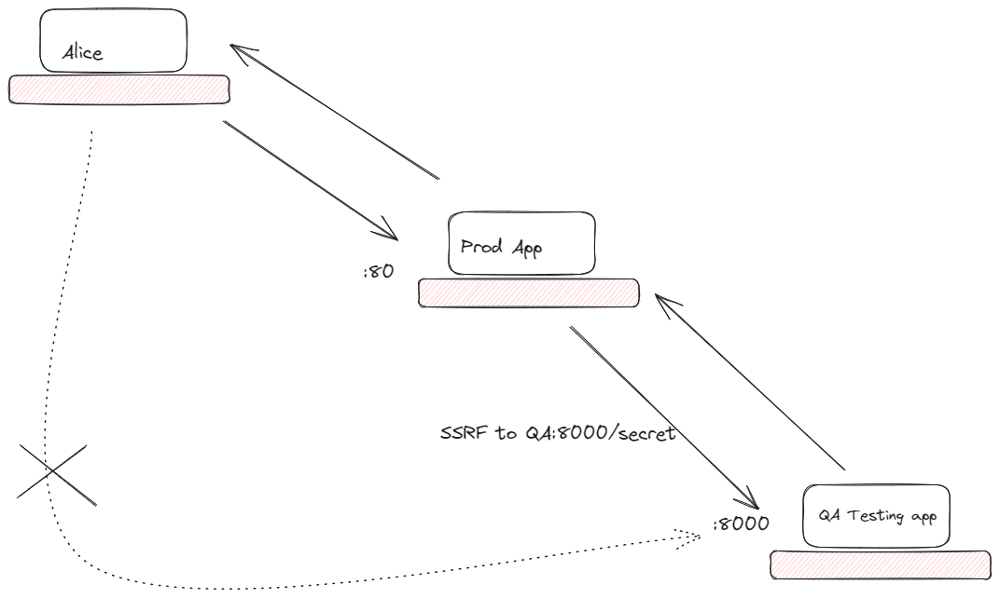

# Simple-SSRF-Lab

Simple SSRF vulnerabilitie Lab in docker

## Estructura



Parámetro inyectable `url`

## 🚀 Uso

El proyecto está contruido en docker, para ejecutar solo clone el repositorio coloquese en la carpeta y ejecute:

```bash
docker-compose up --build
```

## 📝 Licencia

Este proyecto está bajo la licencia GNU - vea el archivo [LICENSE](LICENSE) para más detalles.
